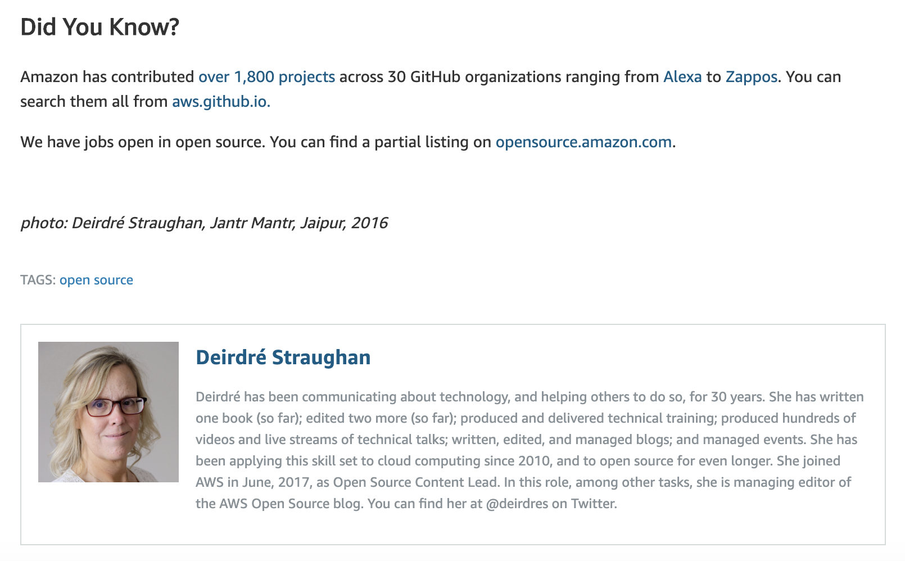
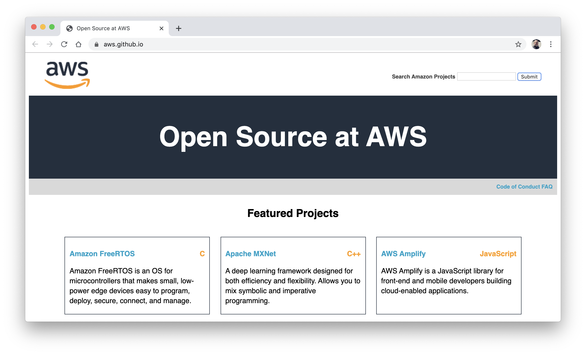

# Analyzing Amazon's Free and Open Source Software (FOSS) Contributions

This project analyzes Amazon's Free and Open Source Software (FOSS) Contributions to 
determine the extent to which they behave as good citizens of the open source community. 
Much has been said about Amazon and open source software, much of it good from Amazon and
much of it bad from the community. But what is the reality? Numbers that tend to indicate 
good citizenship are cited by Amazon, Google, Microsoft and other cloud providers but they 
are never checked for accuracy, honesty and integrity. This project aims to change that by 
rigorously evaluating the open source contributions of cloud providers, starting with Amazon.


This project is an attempt to check the veracity of the claim made by Deirdré Straughan, managing editor of the AWS Open Source blog, on April 8, 2019 that, "Amazon has contributed [over 1,800 projects](https://github.com/search?utf8=%E2%9C%93&q=+user%3Aalexa+user%3Aamzn+user%3Aaws+user%3Aawsdocs+user%3Aawslabs+user%3Aaws-quickstart+user%3Ablox+user%3Aboto+user%3Ac9+user%3Acorretto+user%3Afirecracker-microvm+user%3Aaws-robotics+user%3Aajaxorg+user%3Agluon-api+user%3Acloud9ide+user%3ACarbonado+user%3Agoodreads+user%3AIvonaSoftware+user%3Atwitchtv+user%3Atwitchdev+user%3Atwitchscience+user%3Ajustintv+user%3AZappos+user%3Aamazon-archives+user%3Aalexa-labs+user%3Aaws-samples+user%3Aaws-amplify+user%3Aaws-cloudformation+user%3Aaws-solutions+user%3Aopendistro-for-elasticsearch+user%3Aopendistro&type=Repositories&ref=advsearch&l=&l=) 
across 30 GitHub organizations ranging from [Alexa](https://github.com/alexa) to 
[Zappos](https://github.com/Zappos). You can search them all from 
[aws.github.com](https://aws.github.io/)."

This link shows 2,469 repository results as of Dec 18, 2019.

## Image of the Original Quote



## aws.github.io

Note that this query is also present in the search box at [https://aws.github.io/](https://aws.github.io/), clicking submit takes you [here](https://github.com/search?utf8=%E2%9C%93&q=+user%3Aalexa+user%3Aamzn+user%3Aaws+user%3Aawsdocs+user%3Aawslabs+user%3Aaws-quickstart+user%3Ablox+user%3Aboto+user%3Ac9+user%3Acorretto+user%3Afirecracker-microvm+user%3Aaws-robotics+user%3Aajaxorg+user%3Agluon-api+user%3Acloud9ide+user%3ACarbonado+user%3Agoodreads+user%3AIvonaSoftware+user%3Atwitchtv+user%3Atwitchdev+user%3Atwitchscience+user%3Ajustintv+user%3AZappos+user%3Aamazon-archives+user%3Aalexa-labs+user%3Aaws-samples+user%3Aaws-amplify+user%3Aaws-cloudformation+user%3Aaws-solutions+user%3Aopendistro-for-elasticsearch+user%3Aopendistro&type=Repositories&ref=advsearch&l=&l=) (which is the same query). This link shows 2,469 repository results as of Dec 18, 2019.



## What is the point of this?

It is critical that the community check the veracity of claims of cloud vendors like this one because as they capture more and more of the value of free and open source software through Software as a Service (SaaS) APIs in their clouds, it is essential that they step up and contribute to replace those contributors who no longer run their own software and thus no longer patch it. 

Bad actors in open source harm the community. But who bad? Let's find out!

## Environment Setup

This project uses Anaconda Python 3.7.4 but should run in any Python 3.

### Conda

```bash
conda create -n amazon python=3.7.4
conda install --file requirements.txt -y
```

### Virtual Environment

```bash
sudo pip3 install virtualenv 
virtualenv -p python3 venv
source venv/bin/activate
pip install -r requirements.txt
```

## Updating the List of Repositories

The data as of December 19, 2019 is included in this repository's [data/](data/) directory. To update the analysis with new data, you can download the data in the following way:

1. The original query from Amazon is defined in [query.txt](query.txt). You will need to update this to whatever query they are using at the time you do the update - it may include more usernames because of acquisitions or new activity.

2. The user names that make up this query are then extracted in [1_get_users_from_query.py](1_get_users_from_query.py) and stored in [data/users.txt](data/users.txt).

3. These usernames are then loaded by [2_search_github_repos.sh](2_search_github_repos.sh), which hits the Github Search API for each user, paginating the results and storing them in JSON Lines format in [data/aws_repos.jsonl](data/aws_repos.jsonl).

This data is then loaded in the Jupyter Notebook where the analysis occurs.


## Evaluating the Training Data

Because it was not feasible for the author to hand label all the data, and because he is
writing a book called *Weakly Supervised Learning* and needed an example topic, this project 
uses *weak supervision* to take a sample of 200 labeled records that guide data programming 
to label the rest using Snorkel's unsupervised generative model to combine the weak labels 
of each data program into strong labels for all of the records.

The 200 labeled records along with the rest of the records describing the 2,469 repositories 
claimed by Amazon as of December 19, 2019, are available in a Google Doc 
[here](https://docs.google.com/spreadsheets/d/1ULt0KxIdb5HUJCEMt_AmOuPbTvN1zg8UA_4RvjlVwXQ/edit?usp=sharing). 
The idea is that if anyone disputes this example's conclusions, they can hand label the 
entire dataset themselves and do so with hard evidence. I could then incorporate this new
labeling in the analysis I performed in place of the data labeled using weak supervision
and Snorkel.

### Label Schema

The labels for this dataset are:

| Number | Code      | Description                      |
|--------|-----------|----------------------------------|
| -1     | ABSTAIN   | No vote, for Labeling Functions  |
| 0      | GENERAL   | A FOSS project of general appeal |
| 1      | API       | An API library for AWS           |
| 2      | EDUCATION | An educational example for AWS   |
| 3      | DATASET   | An open dataset by Amazon        |

### Labeling Functions

Labeling functions each weakly label the data and need only be better than random. Snorkel's
unsupervised generative graphical model combines these weak labels into strong labels by 
looking at the overlap, conflict and coverage of each weak label set.

| Logic                  | Fields                               | Label       | 200 Sample Accuracy |
|------------------------|--------------------------------------|-------------|---------------------|
| If 'sdk' is in         | `full_name`, `description`, `readme` | `API`       |                     |
| If 'sample' is in      | `full_name`, `description`, `readme` | `EDUCATION` |                     |
| If 'dataset' is in     | `full_name`, `description`, `readme` | `DATASET`   |                     |
| If 'demonstrate' is in | `full_name`, `description`, `readme` | `EDUCATION` |                     |
| If 'walkthrough' is in | `full_name`, `description`, `readme` | `EDUCATION` |                     |
| If 'skill' is in       | `full_name`, `description`           | `EDUCATION` |                     |
| If 'kit' is in         | `full_name`, `description`           | `EDUCATION` |                     |
| If 'toolbox' is in     | `description`                        | `GENERAL`   |                     |
|                        |                                      |             |                     |

## Running the Analysis

The actual analysis is in a Jupyter Notebook called [Amazon Open Source Analysis.ipynb](Amazon Open Source Analysis.ipynb).

### Creating a Personal Access Token

If you want to fetch the latest READMEs of Amazon's repositories, you will need to [create a Github personal access token](https://help.github.com/en/github/authenticating-to-github/creating-a-personal-access-token-for-the-command-line) and set it to the environment variable `GITHUB_PERSONAL_TOKEN`.


### Starting Jupyter

If you are updating the README content, feed Jupyter your Github personal access token as an environment variable:

```bash
GITHUB_PERSONAL_TOKEN=<GITHUB_PERSONAL_TOKEN> jupyter notebook
```

Then open the url: [http://localhost:8888](http://localhost:8888)

